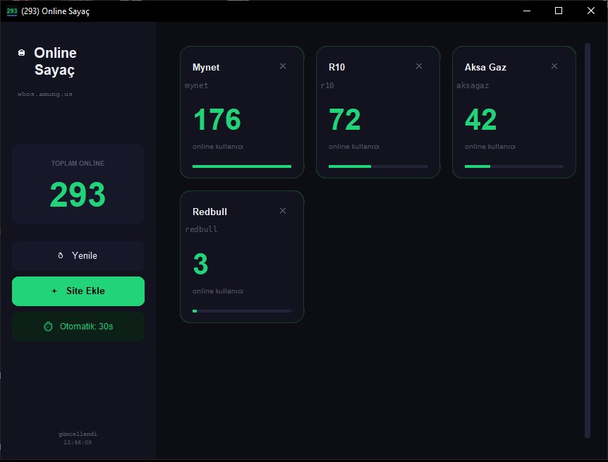

# Amung - Online User Counter

A desktop application that tracks real-time online user counts for your websites using [whos.amung.us](https://whos.amung.us) widgets.

## Screenshots



## Features

- 📊 Track multiple websites simultaneously
- 🔄 Auto-refresh every 30 seconds
- 💾 Sites are saved locally (`sites.conf`)
- 🎨 Clean dark UI
- 🖼️ Taskbar icon shows total online count

## Requirements

- Python 3.8+
- customtkinter
- requests
- Pillow

## Installation

```bash
pip install customtkinter requests Pillow
python main.py
```

## Usage

1. Click **+ Site Ekle** to add a new site
2. Enter a name and your `whos.amung.us` swidget code
3. The app will automatically fetch online counts

## Getting Your swidget Code

1. Go to [whos.amung.us](https://whos.amung.us)
2. Create a widget for your website
3. Copy the code from the widget URL:  
   `whos.amung.us/swidget/`**`YOUR_CODE`**

## License

MIT
